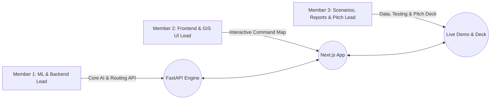

# 🌊 Cascading Disaster Intelligence & Resource Allocation Platform
## 🏆 48-Hour Hackathon Execution Roadmap & Team Work Division
**Project Domain:** AI for Disaster Management & Emergency Logistics  
**Team Size:** 3 Members | **Target:** Smart India Hackathon (SIH 2026) / Demo Day  

---

## 📌 1. Project Vision & Core Problem Statement

Traditional disaster forecasting models treat hazards in isolation (e.g. only measuring rainfall). In real emergencies, hazards trigger **cascading domino effects**:
1. **Primary Hazard:** Intense rainfall / water surge.
2. **First-Order Impact:** Road submergence & structural cutoffs.
3. **Second-Order Cascade:** Essential facilities isolated (Hospitals cut off, Shelters overloaded).
4. **Third-Order Cascade:** Utility failures (Power grid shutdown, Telecom communication blackout).
5. **Operational Bottleneck:** Limited ambulances & rescue boats stranded or sub-optimally routed.

**Our Solution:** An end-to-end AI command center that models the complete cascade graph, dynamically computes priority risk scores, and uses algorithmic optimization (`ortools` / heuristic routing) to dispatch critical resources along safe, unblocked routes in real time.

---

## 👥 2. 3-Member Role Division & Task Matrix



### 🧑‍💻 Member 1: AI, ML & Backend Lead
**Focus:** Physics-informed ML, cascading domino propagation, and routing algorithms.

- [ ] **Task 1.1: Live Weather API Feed**
  - Integrate [Open-Meteo API](https://open-meteo.com/) (free, no API key needed) for live Bihar coordinates (`lat=25.15, lon=85.95`).
  - When `mode === 'live'`, fetch real-time precipitation, wind speed, and soil saturation.
- [ ] **Task 1.2: Expanded Cascading Graph Engine**
  - Add secondary cascading infrastructure nodes in `cascade_engine.py`:
    - `PowerGridSubstation` (Fails when flood risk > 0.70 $\rightarrow$ hospital emergency generator countdown).
    - `TelecomTower` (Fails when water level > 6m $\rightarrow$ SMS communication blackout warning).
- [ ] **Task 1.3: Dynamic Detour Routing in Optimizer**
  - Update `resource_optimizer.py` to account for blocked roads ($R_1, R_2, R_3$).
  - Calculate detour penalties and ETA with realistic routing logic rather than straight-line distance.
- [ ] **Task 1.4: API Validation & Endpoints**
  - Ensure `/api/disaster/analyze` and `/api/ml/experimental` respond reliably under < 200ms.

---

### 🎨 Member 2: Frontend & GIS Map Lead
**Focus:** Next.js UI, React-Leaflet interactive maps, dynamic visual layers, and command HUD.

- [ ] **Task 2.1: Advanced Leaflet Layers & Controls**
  - Add layer toggles: `[✓] Blocked Roads`, `[✓] Critical Hospitals`, `[✓] Relief Shelters`, `[✓] Resource Dispatch Lines`.
  - Style blocked roads with animated red dashed lines and open roads with green solid lines.
- [ ] **Task 2.2: Time-Series Progression Slider (T+0h to T+12h)**
  - Add an interactive timeline slider on the dashboard to visualize disaster progression over time (flood spread, road closure sequence, dispatch movement).
- [ ] **Task 2.3: Real-Time Resource Dispatch HUD**
  - Show live allocation cards with status badges (`En Route`, `Dispatched`, `Standby`).
  - Add button to simulate *"Dispatch Resource"* with visual route highlight on the map.
- [ ] **Task 2.4: Dark Tactical Theme Polish**
  - Refine Tailwind CSS classes, glassmorphism cards, pulsating alert badges, and loading skeletons.

---

### 🚀 Member 3: Scenarios, Authority Reports & Pitch Lead
**Focus:** Real-world demo presets, PDF/print situation reports, and pitch deck delivery.

- [ ] **Task 3.1: 1-Click Preset Demo Scenarios**
  - Add 3 quick scenario buttons on the UI for live judge testing:
    1. 🟢 **Scenario A (Normal/Monitoring):** Rainfall 40mm, Duration 1h $\rightarrow$ Green status, normal flow.
    2. 🟡 **Scenario B (Heavy Monsoon):** Rainfall 120mm, Duration 3h $\rightarrow$ Road R1 blocked, ambulance dispatched.
    3. 🔴 **Scenario C (Bihar 2024 Flash Flood):** Rainfall 220mm, Duration 6h $\rightarrow$ Critical cascade, multiple road cutoffs, resource constraint warning.
- [ ] **Task 3.2: One-Click NDRF Situation Report (PDF / Print View)**
  - Add an **"Export Situation Report"** button generating a clean, printable PDF/HTML summary with casualty risk, affected villages, and resource gaps for district collectors.
- [ ] **Task 3.3: Citizen SOS Distress Feed (Mock/Simulated)**
  - Build an incoming SOS alert feed component showing incoming citizen alerts (e.g. *"Village V2: 12 families stranded near temple"*).
- [ ] **Task 3.4: Pitch Deck & 3-Minute Demo Script**
  - Create the 8-slide pitch deck (Problem, Architecture, Cascade AI, Demo, Real-world Impact).
  - Rehearse the live demo workflow end-to-end.

---

## ⏱️ 3. Hour-by-Hour 48-Hour Sprint Schedule

```
+-------------------------------------------------------------------------+
| DAY 1: CORE CAPABILITIES & DATA FLOW                                    |
+-------------------------------------------------------------------------+
| [00h - 04h] Sync & Baseline Setup: Git branch rules, verify backend/UI.  |
| [04h - 08h] Backend: Open-Meteo weather feed + cascading graph update.  |
| [04h - 08h] Frontend: Leaflet map layer toggles & marker styling.        |
| [08h - 12h] Scenarios: Create 3 preset demo triggers in UI.             |
| [12h - 16h] Optimizer: Detour routing algorithm around blocked roads.   |
| [16h - 20h] Frontend: Time-series slider (Hour 0 -> Hour 12 spread).     |
| [20h - 24h] Mid-Sprint Integration Check: Full pipeline test.           |
+-------------------------------------------------------------------------+
| DAY 2: FEATURES, POLISH, REPORTS & DEMO PRACTICE                        |
+-------------------------------------------------------------------------+
| [24h - 28h] Member 3: Situation Report PDF/Print generator.             |
| [28h - 32h] Member 2: Citizen SOS feed & tactical HUD polishing.        |
| [32h - 36h] Member 1: Model calibration card & edge case error handling. |
| [36h - 40h] CODE FREEZE: Lock main branch, deploy on local/Vercel.      |
| [40h - 44h] Pitch Deck Finalization (8 slides, high-res diagrams).      |
| [44h - 48h] Pitch Rehearsal (3-minute timed script + Q&A prep).         |
+-------------------------------------------------------------------------+
```

---

## 🎯 4. Key Differentiators for Hackathon Judges

| Evaluation Criteria | How Our Platform Wins |
| :--- | :--- |
| **Innovation & Concept** | Models the **cascading domino effect** (flood $\rightarrow$ road $\rightarrow$ hospital $\rightarrow$ resource bottleneck), not just flood prediction alone. |
| **Technical Complexity** | Physical + ML calibrated model (XGBoost) combined with OR-Tools constraint optimization. |
| **Actionability & UI** | Clear, actionable command center map with real-time ETA, dispatch paths, and resource deficit warnings. |
| **Feasibility & Scalability** | Decoupled microservice architecture; easily deployable to any district/state with GIS CSV/GeoJSON ingestion. |
| **Demo Impact** | 1-Click presets allow judges to interactively witness the simulation in under 30 seconds. |

---

## 🎤 5. Winning 3-Minute Pitch Script & Slide Outline

### Slide Structure (8 Slides)
1. **Title:** Cascading Disaster Intelligence & Autonomous Resource Dispatch Platform (SIH 2026).
2. **The Problem:** Disasters aren't single events—they are chain reactions. 70% of relief delays occur due to unexpected infrastructure cutoffs.
3. **The Solution:** An AI-powered decision support system that predicts domino hazards and dispatches resources before access routes close.
4. **Architecture & Pipeline:** Weather Data $\rightarrow$ Physical ML Hazard Engine $\rightarrow$ Cascade Graph $\rightarrow$ Priority Engine $\rightarrow$ OR-Tools Allocator $\rightarrow$ Interactive Map HUD.
5. **Live Demo Walkthrough:** (Run Scenario B & C live on screen).
6. **Key Features & Innovation:** Dynamic rerouting around flooded roads + resource gap analysis for NDRF.
7. **Impact & Scalability:** Zero-cost open data integration, extensible to landslides, cyclones, and urban flooding across India.
8. **Team & Conclusion:** Ready for pilot testing with District Disaster Management Authorities (DDMA).

---

## 🛠️ 6. Quick Command Cheatsheet

### Backend
```bash
cd backend
# Install dependencies
pip install fastapi uvicorn pydantic pandas joblib xgboost ortools scikit-learn requests

# Start server
uvicorn main:app --reload --port 8000
```

### Frontend
```bash
cd frontend
# Install dependencies
npm install

# Start development server
npm run dev
# Open http://localhost:3000
```
